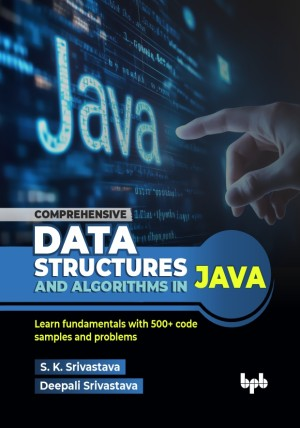

# Comprehensive Data Structures and Algorithms in Java

Learn fundamentals with 500+ code samples and problems.

This is the repository for [Comprehensive Data Structures and Algorithms in Java
](https://bpbonline.com/products/comprehensive-data-structures-and-algorithms-in-java?variant=44765251403976),published by BPB Publications.

## About the Book
Data Structures and Algorithms is an important subject in any university curriculum for computer science stream. It provides a great tool in the hands of software engineers and plays significant role in software design and development. It is also becoming a must have skill for many competitions and job interviews in software industry.

This book covers the topics useful for students and also for software developers working in industry. The concepts are explained in step-wise manner and illustrated with numerous figures, text, examples and immediate code samples which helps in better understanding of data structures and algorithms with their implementation. There are exercises at the end of the chapters which helps students to explore more and build better foundation of subject. The book has more than 500 illustrations, code samples and problems. Solutions for exercises are also available with programs. Students can use it for self-learning and developers can use this for providing efficient solutions for their day-to-day development problems.

After completion of this book, students will have good understanding of Data Structures and Algorithms concepts and implementation. Software engineers will be able to provide better solutions with appropriate data structures and efficient algorithms.

## What You Will Learn
• Fundaments of data structures and algorithms.

• Algorithms analysis.

• Variety of data structures and algorithms useful for software design and development.

• How to efficiently use different data structures and algorithms.

• When and where to use appropriate data structures and algorithms.

• Data structures and algorithms concepts with implementation.

• Approach to solve problems using right data structures and algorithms.
